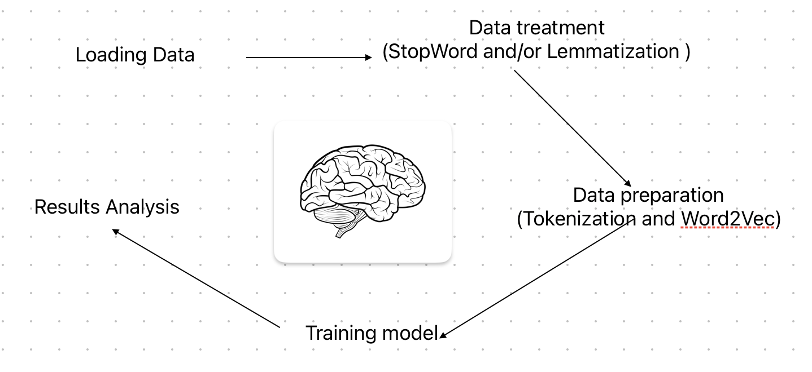
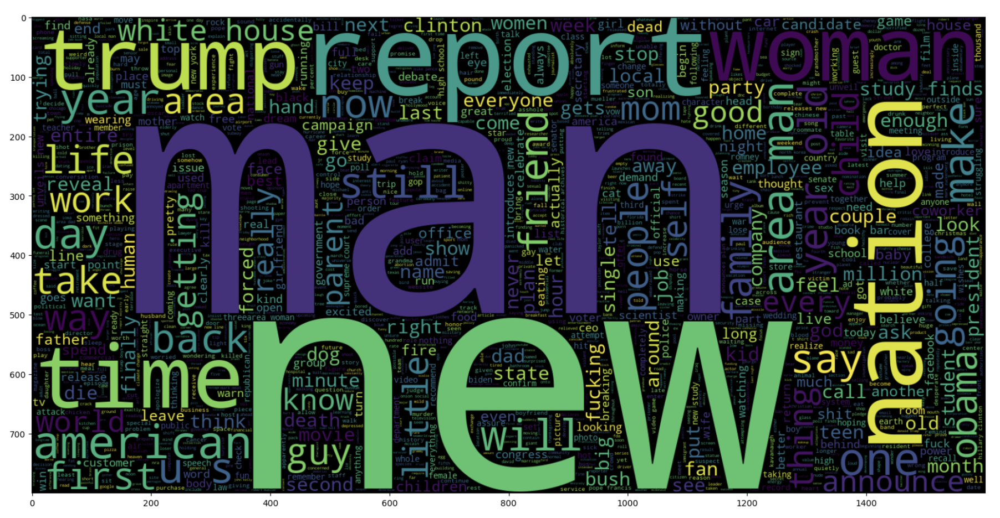
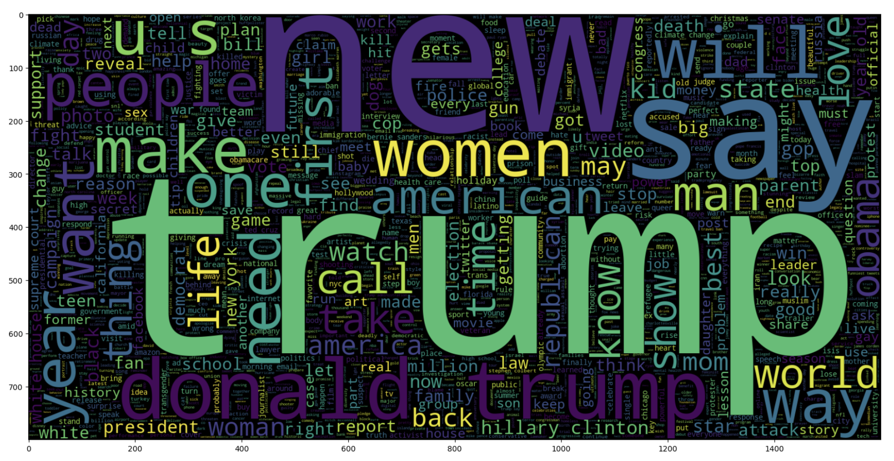
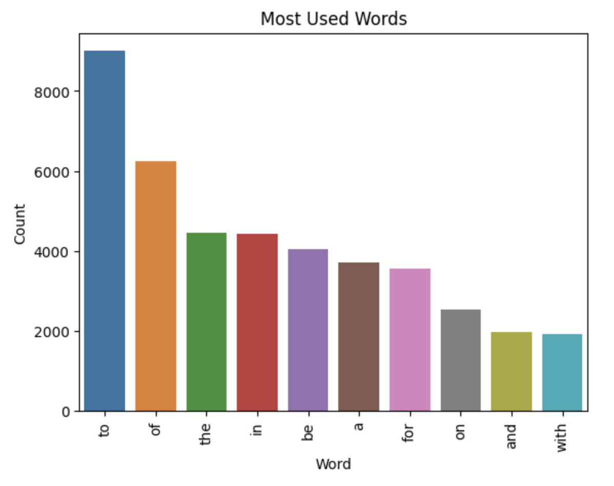
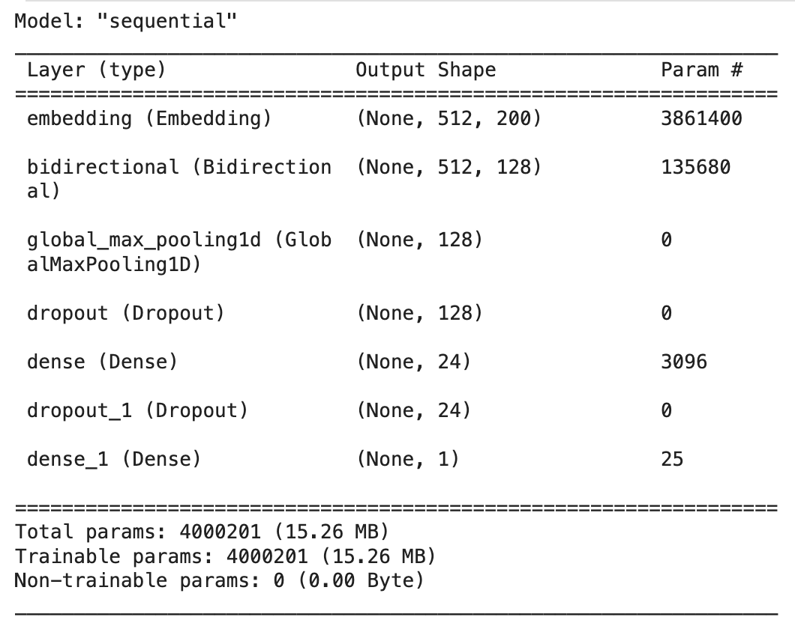
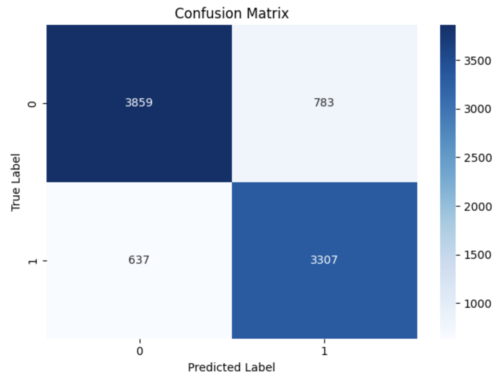
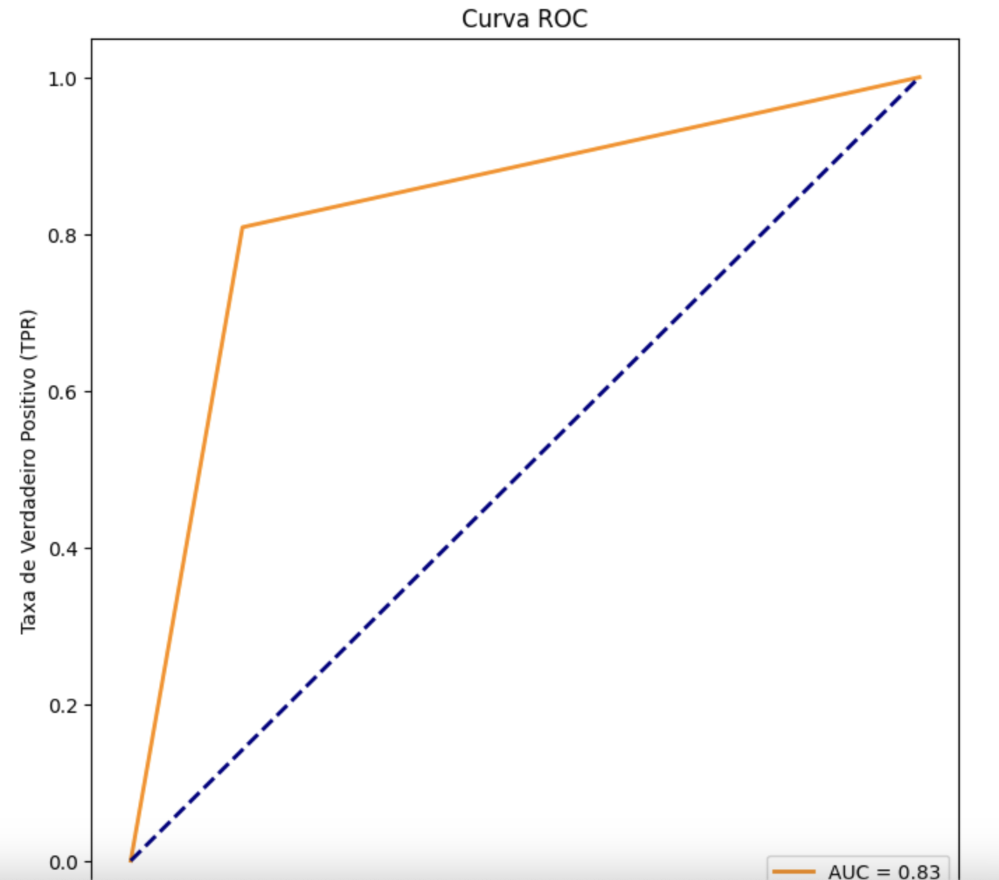
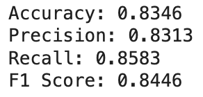
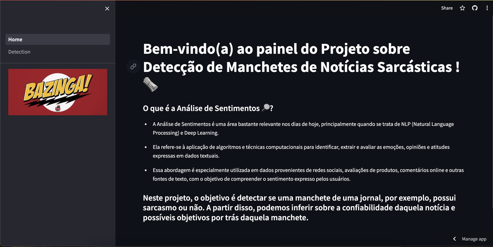

# Sentiment Analysis: Sarcastic Detection 📰 

 

Sentiment analysis, also known as opinion mining, is a natural language processing (NLP) technique used to determine the emotional tone or attitude expressed in a piece of text. The primary goal of sentiment analysis is to understand whether the text conveys a positive, negative, or neutral sentiment. This analysis can be applied to various types of textual data, including customer reviews, social media posts, news articles, and more. In the business context, sentiment analysis is crucial for several reasons: 

- Customer or Employee Feedback Analysis
- Brand Monitoring
- Product Development
- Market Research
- Customer Support
- Risk Management
- Marketing Strategy

In this project, we want to detect sarcastic titles in news headlines in order to protect against misinterpretations that can impact decision-making and reputation management. Data for analysis were made available within the data competitions platform [Kaggle](https://www.kaggle.com/datasets/rmisra/news-headlines-dataset-for-sarcasm-detection/discussion). 

# 1.0 Business Problem 

Buzzfeed is a journalistic company that publishes news headlines on a wide range of topics around the world. However, it needs someone to analyze its headlines to detect whether there is sarcasm or not in order to avoid possible misunderstandings among readers. So, using machine learning, deep learning and Natural Language Processing (NLP) methods, i built a model capable of identifying whether a headline contains sarcasm or not based on historical data. The solution can be consulted on the web platform built with Streamlit. 

# 2.0 Business Assumptions 

## 2.1 Data Description 

- Sarcasm_Headlines_Dataset_v2.json:
  
| Variável       | Definição                                                |
| -------------- | -------------------------------------------------------- |
| is_sarcastic   | Indica se é um título sarcástico (1) ou não sarcástico (0) |
| headline       | Títulos das manchetes de notícias                                    |
| article_link   | Link para o artigo                                       |

# 3.0 Solution Strategy 

 

- OBS: After many tests, the model's performance decreases a lot with stop words removal. So, I'll run the model without this process, only with lemmatization. 

# 4.0 Some insights 

## Before lemmatization or stopwords removal: 

### Most Used Words in Sarcastic Titles: 

 

### Most Used Words in Not Sarcastic Titles: 

 

## After lemmatization: 

### Top 10 Most Used Words: 

 

# 5.0 Preprocessing and Embedding layer 

Before build the machine learning model, we need to do the tokenization: The process of breaking down a text into smaller units, known as tokens. These tokens can be words, phrases, symbols, or other meaningful elements, depending on the level of granularity desired for analysis. At the end, i save the tokenizer to a file using pickle library. 

After that, we need start to build the embedding layer. After some tests, i decided to use Word2Vec technique: It's a vector representation of words in a continuous vector space. Word embeddings capture semantic relationships between words, enabling machines to understand the contextual meaning of words in a given text. The term "word2vec" is a combination of "word to vector," indicating the transformation of words into numerical vectors. This layer will be used in the recurrent neural network. 

# 6.0 Machine Learning 

A Recurrent Neural Network (RNN) called LSTM were used to train data. Basically, It begins with an Embedding layer that maps words to dense vectors (Word2Vec), utilizing pre-trained weights (embedding_vectors) to initialize the representations. Next, a Bidirectional Long Short-Term Memory (LSTM) layer is employed to process input sequences in a bidirectional manner. The Max Pooling layer is used to reduce dimensionality, followed by Dropout layers to prevent overfitting. 

After that, a dense layer with ReLU activation is employed, followed by another Dropout layer. Finally, an output dense layer with sigmoid activation is used to generate the binary output. 

## Final Model: 

 

# 7.0 Results 

### We achieved great results 

## Metrics: 

### Confusion Matrix:

### ROC Curve:

### Evaluate Results:

# 8.0 Deployment in Streamlit Cloud 

Development of a streamlit page capable of detect sarcasm in news headlines. The Sarcasm Detect System can be accessed through this link: [Streamlit link](sarcastic-detection.streamlit.app/) 

 

# 9.0 Conclusions 
As a result, it was built a complete machine learning model capable to detect sarcasm in titles . In addition, the consultation for diagnosis by company managers is easy and quick, as the deployment was done on the Streamlit platform Now, BuzzFeed company can avoid possible reader misunderstandings and increase its brand value as a news channel. 

# 10.0 Lessons Learned 
- How to build a NLP project in general
- Lemmatization and tokenizer technique
- Stopwords removal
- Bidirectional LSTM
- How to generate business value with sentiment analysis 

# 11.0 Next Steps 
- Testing more techniques
- Improve the machine learning model
